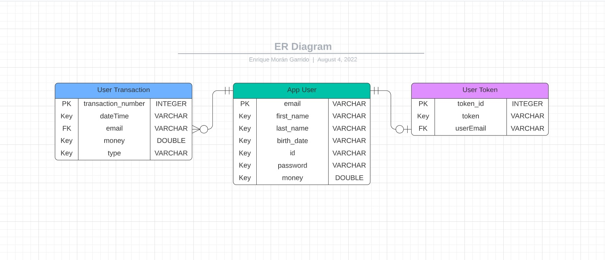

This ERD is a description of entities, their attributes and
the relationships between entities (click on it for a larger jpg
version):

### Description

For this project, three entities were defined: App User, User Token and User Transaction.

#### APP USER

It contains basic information about the user:

- First_name
- Last name
- Birthdate
- Email
- Password
- Id
- Money

When the user is created, most of these parameters are not optional. 
This entity requires the user to create his account with every single
attribute except the money, which is set to zero when the user is created.

Based on bank accounts information, the id is not automatically generated.
This will be set to the given id provided by the user.

In order to avoid user duplication, the email address is declared as the primary key, 
which will be used as a foreign key in the other two entities to identify the user.

#### USER TOKEN

It contains a valid token provided to the user when this is logged in. 
This token allows the user to access and interact with the endpoints. 
This entity sets apart the user basic information with its authorization and
contains the following properties:

- Token id
- User email
- Token

In order to get access to the JSON Web Token generated, it is required to 
enter a valid email address along with its corresponding password.

The token is different for every user and will only work if it is inside the database.
Once logged out, the token will be invalidated and could not be used again. 

The relationship between the user token and the app user is given by the email address.
The app user may have 0 or 1 active token, whilst the user token may correspond to 1
and only 1 app user.

#### USER TRANSACTION

This user transaction entity contains information about the transaction created by the user.
This entity is created once the app user interacts with the transaction endpoints and performs
one or many of the following operations: fill, withdraw, make or receive payments.
The user transaction is made by the following parameters:

- Transaction number
- Date Time
- User email
- Money
- Type

Since there might be different transactions made by the same user, the user email is only used
for identifying the user that created a transaction. Therefore, the relationship between the
app user and the user transaction is determined by the email address. The app user may have made
0 or multiple transactions, whilst each transaction corresponds to 1 and only 1 app user.

